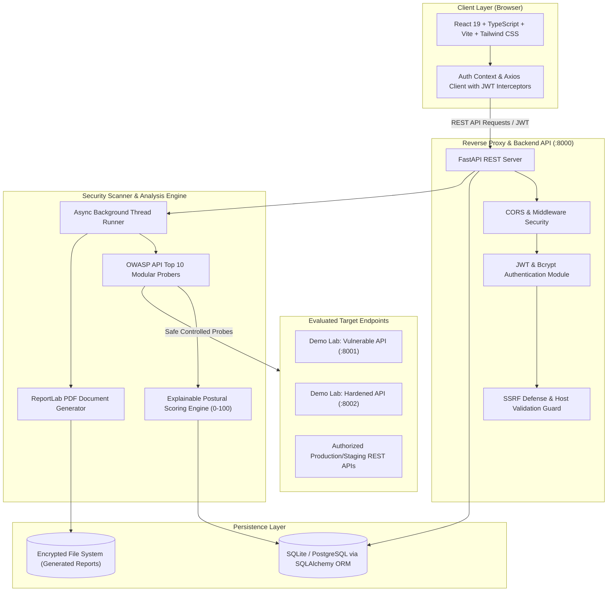
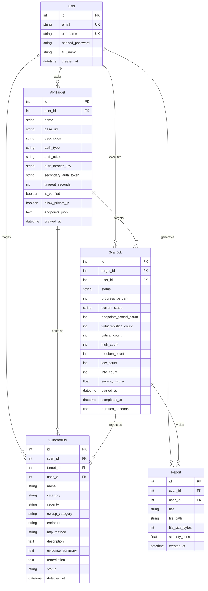
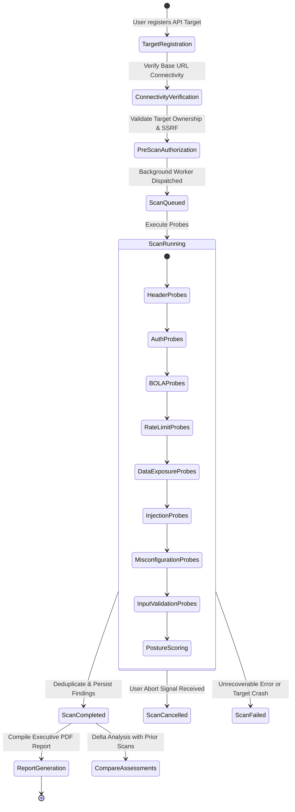

# API Sentinel: Architecture & Security Technical Specification

## 1. System Architecture

```mermaid
flowchart TB
    subgraph Client ["Client Layer (Browser)"]
        UI["React 19 + TypeScript + Vite + Tailwind CSS"]
        State["Auth Context & Axios Client with JWT Interceptors"]
        UI --> State
    end

    subgraph Gateway ["Reverse Proxy & Backend API (:8000)"]
        FastAPI["FastAPI REST Server"]
        CORS["CORS & Middleware Security"]
        SSRF["SSRF Defense & Host Validation Guard"]
        AuthM["JWT & Bcrypt Authentication Module"]
    end

    subgraph CoreEngine ["Security Scanner & Analysis Engine"]
        Worker["Async Background Thread Runner"]
        Modules["OWASP API Top 10 Modular Probers"]
        Scorer["Explainable Postural Scoring Engine (0-100)"]
        PDF["ReportLab PDF Document Generator"]
    end

    subgraph Storage ["Persistence Layer"]
        DB[(SQLite / PostgreSQL via SQLAlchemy ORM)]
        ReportsFS[("Encrypted File System (Generated Reports)")]
    end

    subgraph Targets ["Evaluated Target Endpoints"]
        VulnTarget["Demo Lab: Vulnerable API (:8001)"]
        SecTarget["Demo Lab: Hardened API (:8002)"]
        External["Authorized Production/Staging REST APIs"]
    end

    State -->|REST API Requests / JWT| FastAPI
    FastAPI --> CORS --> AuthM --> SSRF
    FastAPI --> DB
    FastAPI --> Worker
    Worker --> Modules
    Modules -->|Safe Controlled Probes| Targets
    Modules --> Scorer
    Scorer --> DB
    Worker --> PDF
    PDF --> ReportsFS
```

## 2. Database Entity Relationship (ER) Diagram

```mermaid
erDiagram
    User ||--o{ APITarget : owns
    User ||--o{ ScanJob : executes
    User ||--o{ Vulnerability : triages
    User ||--o{ Report : generates

    APITarget ||--o{ ScanJob : targets
    APITarget ||--o{ Vulnerability : contains

    ScanJob ||--o{ Vulnerability : produces
    ScanJob ||--o{ Report : yields

    User {
        int id PK
        string email UK
        string username UK
        string hashed_password
        string full_name
        datetime created_at
    }

    APITarget {
        int id PK
        int user_id FK
        string name
        string base_url
        string description
        string auth_type
        string auth_token
        string auth_header_key
        string secondary_auth_token
        int timeout_seconds
        boolean is_verified
        boolean allow_private_ip
        text endpoints_json
        datetime created_at
    }

    ScanJob {
        int id PK
        int target_id FK
        int user_id FK
        string status
        int progress_percent
        string current_stage
        int endpoints_tested_count
        int vulnerabilities_count
        int critical_count
        int high_count
        int medium_count
        int low_count
        int info_count
        float security_score
        datetime started_at
        datetime completed_at
        float duration_seconds
    }

    Vulnerability {
        int id PK
        int scan_id FK
        int target_id FK
        int user_id FK
        string name
        string category
        string severity
        string owasp_category
        string endpoint
        string http_method
        text description
        text evidence_summary
        text remediation
        string status
        datetime detected_at
    }

    Report {
        int id PK
        int scan_id FK
        int user_id FK
        string title
        string file_path
        int file_size_bytes
        float security_score
        datetime created_at
    }
```

## 3. Assessment Workflow & State Machine

```mermaid
stateDiagram-v2
    [*] --> TargetRegistration: User registers API Target
    TargetRegistration --> ConnectivityVerification: Verify Base URL Connectivity
    ConnectivityVerification --> PreScanAuthorization: Validate Target Ownership & SSRF
    PreScanAuthorization --> ScanQueued: Background Worker Dispatched
    ScanQueued --> ScanRunning: Execute Probes
    
    state ScanRunning {
        [*] --> HeaderProbes
        HeaderProbes --> AuthProbes
        AuthProbes --> BOLAProbes
        BOLAProbes --> RateLimitProbes
        RateLimitProbes --> DataExposureProbes
        DataExposureProbes --> InjectionProbes
        InjectionProbes --> MisconfigurationProbes
        MisconfigurationProbes --> InputValidationProbes
        InputValidationProbes --> PostureScoring
    }

    ScanRunning --> ScanCompleted: Deduplicate & Persist Findings
    ScanRunning --> ScanCancelled: User Abort Signal Received
    ScanRunning --> ScanFailed: Unrecoverable Error or Target Crash
    
    ScanCompleted --> ReportGeneration: Compile Executive PDF Report
    ScanCompleted --> CompareAssessments: Delta Analysis with Prior Scans
    ReportGeneration --> [*]
```

